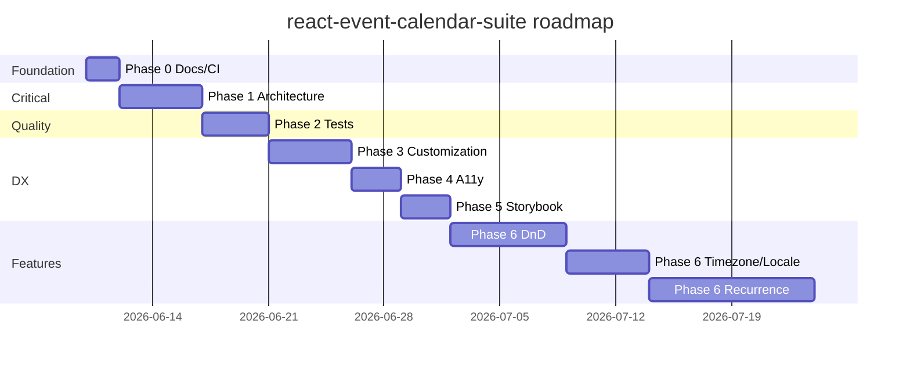

# Implementation Plan: `react-event-calendar-suite`

**Package:** `react-event-calendar-suite`  
**Current version:** `2.3.0`  
**Last updated:** June 10, 2026  
**Status:** Draft roadmap

---

## Table of contents

1. [Goals](#goals)
2. [Current state summary](#current-state-summary)
3. [Phase 0 — Foundation & release hygiene](#phase-0--foundation--release-hygiene)
4. [Phase 1 — Architecture fixes (critical)](#phase-1--architecture-fixes-critical)
5. [Phase 2 — Testing & quality](#phase-2--testing--quality)
6. [Phase 3 — Customization API](#phase-3--customization-api)
7. [Phase 4 — Accessibility](#phase-4--accessibility)
8. [Phase 5 — Docs & Storybook](#phase-5--docs--storybook)
9. [Phase 6 — Advanced calendar features](#phase-6--advanced-calendar-features)
10. [Phase 7 — Headless split (optional, v3)](#phase-7--headless-split-optional-v3)
11. [Timeline](#timeline)
12. [Versioning strategy](#versioning-strategy)
13. [Recommended starting point](#recommended-starting-point)
14. [Open decisions](#open-decisions)

---

## Goals

1. Make the library **safe for production** (instance isolation, controlled API, correctness fixes).
2. Improve **developer trust** (tests, docs, changelog).
3. Close **feature gaps** that block adoption vs other calendar libraries.
4. Keep semver discipline: breaking changes only in **v2.0.0**.

---

## Current state summary

### Strengths

- Five views: month, week, day, list, year
- Spanning / overnight event rendering
- Dynamic color hashing per event type
- Keyboard shortcuts
- ICS export (toolbar + standalone util)
- Zustand-powered internal state
- TypeScript declarations (`types/`)
- Proper npm `exports`, peer deps, and LICENSE (as of v1.1.8)

### Known gaps

| Area | Issue |
|------|-------|
| Architecture | Global Zustand singleton — multiple `<Calendar>` instances share state |
| API | `defaultView` only; no controlled `view` prop |
| API | No `readOnly` mode |
| Correctness | `EventModal` hardcodes 12h format regardless of `timeFormat` prop |
| Correctness | Week numbers use mixed logic (custom vs `dayjs` isoWeek) |
| Correctness | All-day detection requires ≥24h duration; midnight-crossing events missed |
| Features | No drag-and-drop, recurrence, timezone, or ICS import |
| DX | No automated tests, Storybook, or CHANGELOG |
| A11y | Limited ARIA roles and keyboard event navigation |
| Customization | No `renderEvent` or slot APIs |

---

## Phase 0 — Foundation & release hygiene ✅ COMPLETE

**Duration:** 1–2 days  
**Target release:** `1.2.0` (folded into `1.3.0` release line)  
**Breaking changes:** None  
**Shipped in:** `v1.3.0` (June 9, 2026)

| Task | Details | Acceptance criteria |
|------|---------|---------------------|
| Add `CHANGELOG.md` | Document v1.1.8 packaging fixes; template for future releases | Every release has dated entries |
| Add `examples/minimal-vite/` | Tiny app: install peers, import CSS, render `<Calendar />` | New user can run example in under 5 minutes |
| Add `examples/nextjs-app-router/` | `"use client"` wrapper + CSS import documentation | README links to working Next.js example |
| CI script | `npm run build && npm run lint && npm run test` | PRs blocked on failure |
| Version policy | Document major/minor/patch bump rules in CHANGELOG header | Policy is written and linked from README |

---

## Phase 1 — Architecture fixes (critical) ✅ COMPLETE

**Duration:** 3–5 days  
**Target release:** `1.3.0` (additive) or `2.0.0` if bundling internal renames  
**Priority:** Highest — fixes real production bugs  
**Shipped in:** `v1.3.0` (June 9, 2026)

### 1.1 Per-instance store (Context pattern)

Replace the module-level Zustand singleton with a store scoped per `<Calendar>` mount.

```
Calendar (provider)
  └── CalendarStoreContext
        ├── CalenderHeader
        ├── View components (month, week, day, list, year)
        ├── EventModal
        └── useKeyboardShortcuts
```

| Task | Details |
|------|---------|
| Create `CalendarProvider` | `createStore()` per mount, not module singleton |
| Add `useCalendarStore(selector?)` | Reads from context; throws if used outside provider |
| Wrap root in `Calender.jsx` | Provider created once per `<Calendar>` instance |
| Update `eventColors.js` | Replace `useCalendarStore.getState()` with context-safe access |

**Acceptance criteria:**

- Two `<Calendar>` instances on one page have independent date, view, events, and modal state
- Unmounting one instance does not affect the other
- Dev app demonstrates side-by-side calendars

### 1.2 Controlled view API

| Prop | Type | Behavior |
|------|------|----------|
| `view` | `'month' \| 'week' \| 'day' \| 'list' \| 'year'` | Controlled active view |
| `onViewChange` | `(view) => void` | Already exists — wire as controlled callback |
| `defaultView` | `string` | Used only when `view` is undefined |

**Acceptance criteria:**

- Parent can set `view="week"` and calendar stays in week view
- Toolbar view buttons call `onViewChange`; parent can override navigation

### 1.3 Read-only / editable mode

| Prop | Default | Behavior |
|------|---------|----------|
| `readOnly` | `false` | Disables create, edit, delete modal, date-click create, and add button |
| `showAddEventButton` | `true` | Automatically `false` when `readOnly` is `true` |

**Acceptance criteria:**

- `readOnly` blocks all mutation paths
- `onEventClick` still fires so consumers can open custom detail panels

### 1.4 Correctness fixes

| Issue | Fix |
|-------|-----|
| Modal ignores `timeFormat` | Drive `DatePicker.RangePicker` format from store `timeFormat` (`12h` / `24h`) |
| Week number mismatch | Standardize on `dayjs.isoWeek()` everywhere; remove custom `getWeekNumber` |
| All-day detection | Add `allDay?: boolean` on events; fallback: crosses calendar day **or** duration ≥ 24h |

**Files likely touched:**

- `src/store/useCalendarStore.js`
- `src/Calender.jsx`
- `src/EventModal.jsx`
- `src/utils/dateHelpers.js`
- `types/index.d.ts`

---

## Phase 2 — Testing & quality ✅ COMPLETE

**Duration:** 2–4 days  
**Target release:** `1.4.0`  
**Breaking changes:** None  
**Shipped in:** `v1.4.0` (June 10, 2026)

### 2.1 Test stack

```
vitest + @testing-library/react + jsdom
```

Add to `package.json`:

```json
"scripts": {
  "test": "vitest run",
  "test:watch": "vitest"
}
```

### 2.2 Test files

| File | Coverage |
|------|----------|
| `src/utils/dateHelpers.test.js` | `isEventOnDay`, `isAllDayOrMultiDay`, `formatTime`, week boundaries |
| `src/utils/icsExport.test.js` | RFC 5545 escaping, line folding, empty events, UTC output |
| `src/utils/eventColors.test.js` | Hash consistency, custom `eventColors` override |
| `src/hooks/useKeyboardShortcuts.test.js` | Key handlers, ignored when focus is in inputs |
| `src/store/createCalendarStore.test.js` | Store actions, `readOnly` guards, controlled callbacks |
| `src/Calender.test.jsx` | Renders views, `readOnly`, controlled `view`, instance isolation |

### 2.3 Coverage targets

| Area | Target |
|------|--------|
| `src/utils/*` | ≥ 90% |
| Store actions | ≥ 80% |
| Components | Smoke tests + critical interaction paths |

**Acceptance criteria:**

- `npm test` passes in CI
- Coverage badge added to README

---

## Phase 3 — Customization API ✅ COMPLETE

**Duration:** 3–5 days  
**Target release:** `1.5.0`  
**Breaking changes:** None (additive props only)  
**Shipped in:** `v1.5.0` (June 10, 2026)

### 3.1 Render props / slots

| Prop | Signature | Used in |
|------|-----------|---------|
| `renderEvent` | `(event, context) => ReactNode` | Month, week, day, list views |
| `renderEventTooltip` | `(events, date) => ReactNode` | Month view "+X more" tooltip |
| `renderToolbar` | `(api) => ReactNode` | Replace header entirely |
| `renderEmpty` | `(view) => ReactNode` | List, year, week, and day empty states |

`context` shape:

```typescript
{
  view: CalendarView;
  date: Date;
  isMultiDay: boolean;
  isStartDay: boolean;
  isEndDay: boolean;
  onClick: () => void;
}
```

### 3.2 Loading & async data

| Prop | Behavior |
|------|----------|
| `loading` | Shows skeleton or spinner overlay on the active grid |
| `events` | Unchanged — parent fetches and passes the array |

### 3.3 Extended event schema

```typescript
interface CalendarEvent {
  id: string | number;
  title: string;
  start: Date | string;
  end: Date | string;
  type: string;
  color?: string;
  description?: string;
  location?: string;       // already supported in ICS export
  allDay?: boolean;          // new — explicit all-day flag
  metadata?: Record<string, unknown>;
}
```

Update `types/index.d.ts` and README event schema section.

---

## Phase 4 — Accessibility ✅ COMPLETE

**Duration:** 2–3 days  
**Target release:** `1.6.0`  
**Breaking changes:** None  
**Shipped in:** `v1.6.0` (June 10, 2026)

| Task | Details |
|------|---------|
| Toolbar | `aria-label` on nav buttons; `role="tablist"` on view switcher |
| Grid | `role="grid"` on month/week; `aria-selected` on today cell |
| Keyboard | Document shortcuts via `aria-keyshortcuts`; optional `?` help modal |
| Focus | Roving `tabindex` on event chips in month view |
| Live region | `aria-live="polite"` announces date and view changes |
| Color contrast | Audit type colors on light and dark themes |

**Target:** WCAG 2.1 AA on toolbar and month view (MVP); full audit in follow-up.

Add an **Accessibility** section to README listing supported shortcuts and ARIA behavior.

---

## Phase 5 — Docs & Storybook ✅ COMPLETE

**Duration:** 2–3 days  
**Target release:** `1.7.0`  
**Breaking changes:** None  
**Shipped in:** `v1.7.0` (June 10, 2026)

### 5.1 Storybook stories ✅

| Story | Demonstrates |
|-------|--------------|
| Default | Basic month view with sample events |
| All views | Month / week / day / list / year |
| Controlled | `currentDate` + `view` driven by parent state |
| Read only | `readOnly` + custom `onEventClick` handler |
| Theming | `primaryColor`, `theme`, CSS variable overrides |
| Custom render | `renderEvent` override |
| Two calendars | Instance isolation proof (Phase 1) |

Run locally: `npm run storybook`. Build: `npm run build-storybook`.

### 5.2 Docs ✅ (lightweight markdown; VitePress deferred)

| Doc | Path |
|-----|------|
| Installation & peer deps | `docs/installation.md` |
| SSR / Next.js App Router | `docs/ssr-nextjs.md` |
| Migration v1 → v2 (planned) | `docs/migration-v2.md` |
| Props reference | `types/index.d.ts` |

Storybook published via `.github/workflows/storybook.yml` to GitHub Pages (`STORYBOOK_BASE=/React-Event-Calendar/`).

---

## Phase 6 — Advanced calendar features

**Duration:** 2–4 weeks (pick based on positioning)  
**Target release:** `2.0.0` – `2.2.0`

### 6.1 Drag-and-drop reschedule ✅ COMPLETE

| Scope | Approach |
|-------|----------|
| Week / day timed grids | `@dnd-kit/core` — vertical move + bottom-edge resize, 15-min snap |
| Month view | Day-cell drops (whole-day shift); span bars with left/right edge resize |
| Week all-day row | Same span move + both-edge resize as month |
| New props | `onEventDrop`, `onEventResize`, `disableDrag`, `disableResize` |
| Guard | Disabled when `readOnly` is `true`; per-interaction opt-out via disable flags |

**Effort:** ~5–7 days  
**Release:** `2.0.0`  
**Shipped in:** `v2.0.0` (June 10, 2026)

- `DraggableTimedEvent`, `DraggableSpanEvent`, `CalendarDndProvider`, `DroppableDayColumn`
- Span resize live-previews by stretching from anchored edge (distinct from move)
- `onUpdateEvent` fallback when drop/resize handlers omitted
- Storybook **Drag And Drop** story; README + types documented

### 6.2 Timezone support ✅ COMPLETE

| Task | Details |
|------|---------|
| `timezone` prop | IANA string, e.g. `'America/New_York'` |
| Display | `toDayjs(date, tz)` / `nowInTz(tz)` helpers wrap all dayjs calls in all five views |
| ICS export | `DTSTART;TZID=...` when timezone set, UTC otherwise |
| Toolbar | Active timezone label shown in header sub-line |
| Docs | README prop table, CHANGELOG v2.2.0, Storybook Timezone story |

**Effort:** ~2 days  
**Release:** `2.2.0`  
**Shipped in:** `v2.2.0` (June 10, 2026)

### 6.3 Locale / i18n ✅ COMPLETE

| Task | Details |
|------|---------|
| `locale` prop | BCP-47 tag passed to Ant Design `ConfigProvider` + dayjs locale |
| `startOfWeek` | Locale-driven default when `startOfWeek` is not explicitly set |
| Labels | Month names, day abbreviations from dayjs localeData |

**Effort:** ~2–3 days  
**Release:** `2.3.0`  
**Shipped in:** `v2.3.0` (June 10, 2026)

### 6.4 Recurring events

| Task | Details |
|------|---------|
| Schema | `recurrence?: string` (RRULE) or structured object |
| Expansion | Generate instances for visible date range only |
| UI | Recurrence picker in `EventModal` (presets: daily, weekly, monthly) |
| ICS | Emit `RRULE` in `eventsToICS` |

**Effort:** ~7–10 days  
**Release:** `2.1.0`

### 6.5 ICS import

| Task | Details |
|------|---------|
| `parseICS(content: string): CalendarEvent[]` | New util export at `./utils/icsImport` |
| Toolbar | Optional import button via `showImportButton` prop |
| Dependency | `ical.js` or lightweight RFC 5545 parser |

**Effort:** ~3–4 days  
**Release:** `2.2.0`

---

## Phase 7 — Headless split (optional, v3)

**Duration:** 2–3 weeks  
**Target release:** `3.0.0`  
**Only pursue if npm adoption justifies the effort**

```
@react-event-calendar/core    ← date math, layout, spanning (no UI)
react-event-calendar-suite    ← antd UI layer (current package)
```

Benefits:

- Smaller install for non-antd consumers
- Clearer separation of concerns
- Easier to add alternative UI adapters (e.g. Tailwind)

---

## Timeline



| Milestone | Phases | Estimated calendar time |
|-----------|--------|-------------------------|
| Production-safe v1.x | 0 – 2 | ~2 weeks |
| Feature-complete v1.x | 3 – 5 | +2 weeks (~4 weeks total) |
| Competitive v2.x | 6 | +3–4 weeks (~7–8 weeks total) |

---

## Versioning strategy

| Version | Contents |
|---------|----------|
| `1.2.0` | CHANGELOG, examples, CI |
| `1.3.0` | Context store, controlled `view`, `readOnly`, correctness fixes |
| `1.4.0` | Test suite |
| `1.5.0` | `renderEvent`, `loading`, `allDay` flag |
| `1.6.0` | Accessibility pass |
| `1.7.0` | Storybook |
| `2.0.0` | Drag-and-drop, timezone, locale; internal `Calender` → `Calendar` rename |
| `2.1.0` | Recurring events |
| `2.2.0` | ICS import |
| `2.3.0` | Locale / i18n |

### Semver rules

- **Patch** — bug fixes, docs, no API changes
- **Minor** — additive props, new exports, backward compatible
- **Major** — removed/renamed props, changed default behavior, peer dep range changes

---

## Recommended starting point

Highest ROI tasks to tackle first (this week):

1. **Per-instance Context store** — prevents silent bugs with multiple calendars
2. **`readOnly` + controlled `view`** — common enterprise requirement
3. **Fix modal `timeFormat` + week number logic** — quick correctness wins
4. **Unit tests for `dateHelpers` + `icsExport`** — safety net before larger refactors

### Suggested file creation order

```
src/context/CalendarStoreContext.jsx   ← new
src/store/createCalendarStore.js       ← new (factory, replaces singleton)
src/store/useCalendarStore.js          ← refactor to use context
CHANGELOG.md                           ← new
examples/minimal-vite/                 ← new
vitest.config.js                       ← new (Phase 2)
```

---

## Open decisions

Resolve these before starting Phase 1:

| Decision | Options | Recommendation |
|----------|---------|----------------|
| Store pattern | Context vs Zustand per instance | **Context + `createStore()` per provider** |
| Drag-and-drop library | Native HTML5 vs `@dnd-kit` | **`@dnd-kit`** (better touch and accessibility) |
| Recurrence format | Custom object vs RRULE string | **RRULE string** (ICS interoperability) |
| v2 breaking changes | Rename internal `Calender` files? | **Yes in v2.0**; keep `Calendar` as the only public export |
| Storybook hosting | GitHub Pages vs Chromatic | **GitHub Pages** (free, simple for OSS) |

---

## References

- [README.md](./README.md) — current public API
- [types/index.d.ts](./types/index.d.ts) — TypeScript definitions
- [package.json](./package.json) — exports and peer dependencies
